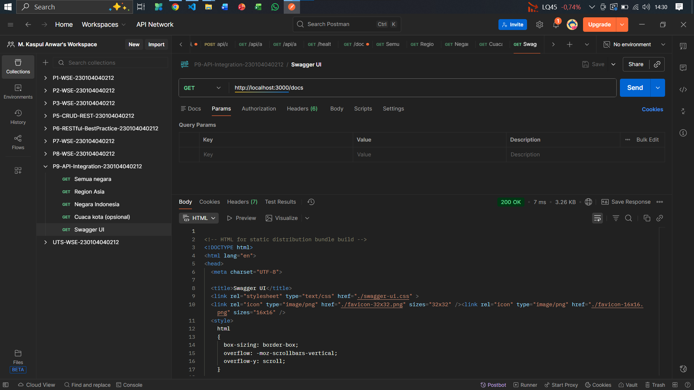
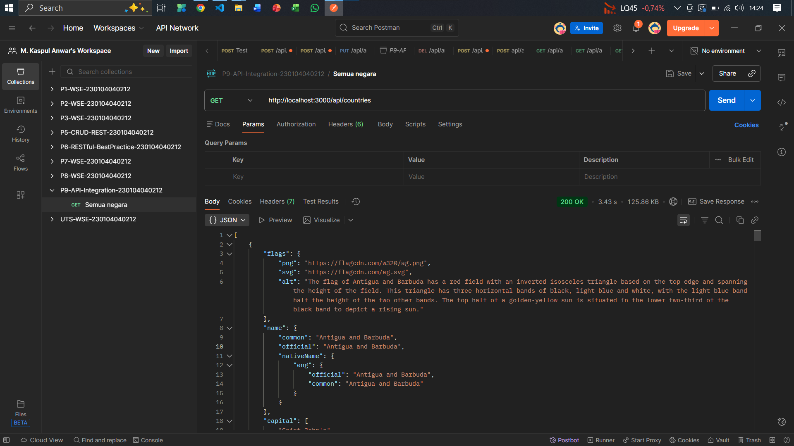
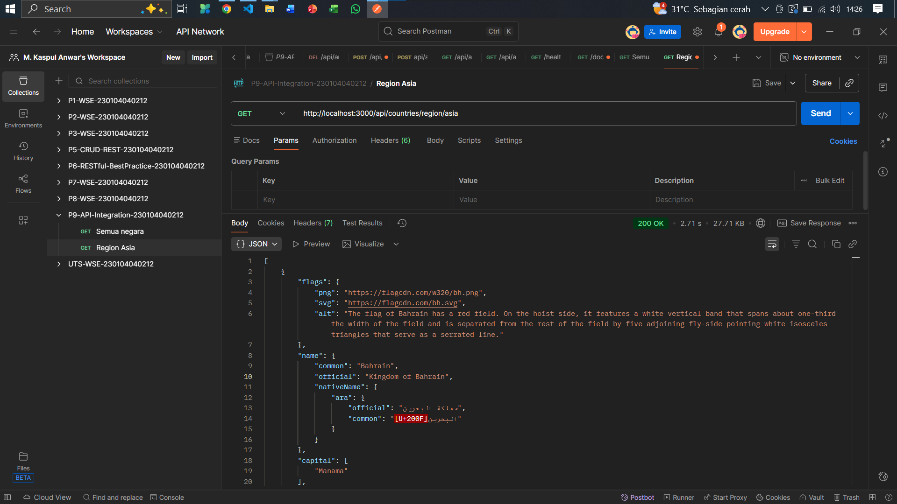
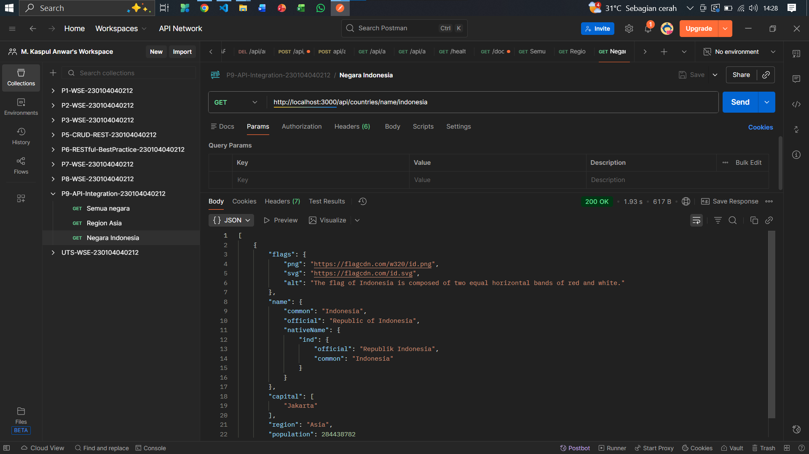
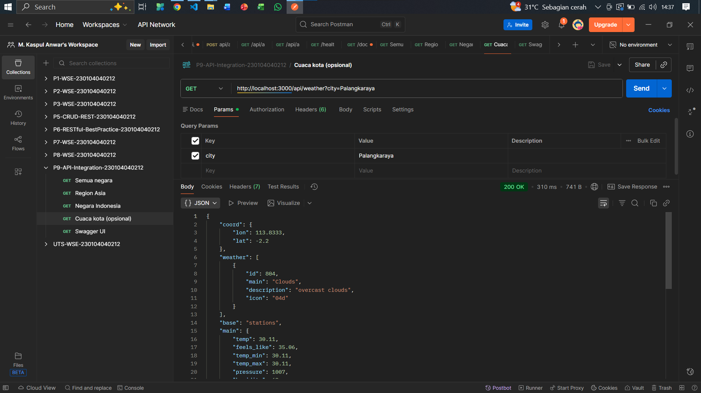

# P9-API-INTEGRATION-230104040212: INTEGRASI API EKSTERNAL

<div align="center">

[](https://nodejs.org/)
[](https://expressjs.com/)
[](https://axios-http.com/)
[](https://www.npmjs.com/package/node-cache)
[](https://www.npmjs.com/package/morgan)
[](https://swagger.io/)
[](https://github.com/motdotla/dotenv)
[](https://www.postman.com/)
[](https://www.google.com/chrome/)

</div>


---

## Deskripsi Praktikum

Repositori ini adalah hasil dari **Praktikum #9 Web Service Engineering** yang berfokus pada pembangunan _API Gateway_ modular menggunakan **Node.js** dan **Express**.

Tujuan proyek ini adalah untuk mengintegrasikan dan mengelola panggilan ke dua API eksternal: **REST Countries** dan **OpenWeatherMap**, dengan menerapkan struktur kode yang terorganisir, _caching_ untuk performa, _logging_, _error handling_, dan dokumentasi interaktif **Swagger UI**.

---

## Tim Developer

| Peran | Nama | NIM | Profil GitHub |
| :--- | :--- | :--- | :--- |
| **Pengembang Proyek** | M. Kaspul Anwar | 230104040212 | [](https://github.com/mkaspulanwar) |
| **Dosen Pengampu** | Muhayat, M. IT | - | [](https://github.com/muhayat-lab) |

---

## Fitur Utama

Berdasarkan tujuan praktikum, fitur-fitur yang diimplementasikan meliputi:

* **Arsitektur Modular**: Pemisahan kode yang ketat menjadi `routes`, `controllers`, `services`, `middleware`, `utils`, dan `docs`.
* **API Integration (Countries)**: Endpoint untuk mengambil semua negara, negara berdasarkan region, dan pencarian berdasarkan nama, dari REST Countries.
* **API Integration (Weather)**: Endpoint untuk mengambil data cuaca dari OpenWeatherMap menggunakan *API Key* dari variabel lingkungan (`.env`).
* **Caching**: Menggunakan `node-cache` untuk menyimpan respons API, memastikan panggilan kedua lebih cepat.
* **Global Error Handling**: Middleware terpusat untuk menangani *error* dan mengembalikan respons JSON yang rapi dan konsisten (termasuk *error* 404/500).
* **Logging**: Menggunakan `morgan` untuk memonitor setiap *request* yang masuk ke server.
* **Dokumentasi API**: Menyajikan dokumentasi interaktif di `/docs` menggunakan **Swagger UI**.

---

## Struktur Proyek

```bash
P9-API-Integration-NimAnda/
├── docs/
│   └── openapi.js         # Spesifikasi OpenAPI/Swagger
├── src/
│   ├── controllers/
│   │   ├── countries.controller.js # Logika Request/Response negara
│   │   └── weather.controller.js   # Logika Request/Response cuaca
│   ├── middleware/
│   │   ├── error.middleware.js     # Global Error Handler (500)
│   │   └── notfound.middleware.js  # Middleware 404 Not Found
│   ├── routes/
│   │   ├── countries.routes.js     # Definisi Endpoint Negara
│   │   └── weather.routes.js       # Definisi Endpoint Cuaca
│   ├── services/
│   │   ├── countries.service.js    # Logic pemanggilan REST Countries (dengan cache)
│   │   └── weather.service.js      # Logic pemanggilan OpenWeatherMap (dengan cache)
│   └── utils/
│       ├── cache.js              # Konfigurasi NodeCache
│       └── httpClient.js         # Konfigurasi Axios/HTTP Client
├── .env                     # Variabel lingkungan (OWM_API_KEY, PORT)
├── package.json
├── README.md
└── server.js                # File utama Express App & inisialisasi
```

## Instalasi dan Setup

### Prasyarat
* **Node.js LTS** terpasang.
* Postman atau *browser* untuk uji *endpoint*.
* Internet aktif (karena memanggil API eksternal).
* **API Key OpenWeatherMap**: Diperlukan untuk layanan cuaca (`OWM_API_KEY`).

### Langkah-langkah Instalasi

1.  **Inisialisasi Proyek dan Instal Dependensi**:
    ```bash
    # Masuk ke folder proyek Anda
    cd P9-API-Integration-NimAnda/

    # Inisialisasi package.json dan instal dependensi utama
    npm init -y
    # express, axios, morgan, node-cache, swagger-ui-express, dotenv
    npm install express axios morgan node-cache swagger-ui-express dotenv 
    # Instal nodemon sebagai dev dependency untuk auto-restart
    npm install nodemon --save-dev
    ```

2.  **Konfigurasi Variabel Lingkungan (.env)**:
    Buat *file* `.env` di *root* proyek dan isikan `PORT` serta `OWM_API_KEY` Anda:
    ```ini
    # .env file
    PORT=3000
    OWM_API_KEY=API_KEY_ANDA_DARI_OPENWEATHERMAP
    ```

3.  **Jalankan Server**:
    Pastikan Anda sudah menambahkan script ` "dev": "nodemon server.js"` di `package.json`.
    ```bash
    npm run dev
    # Atau jika hanya menggunakan npm start:
    # npm start
    ```

---

## Panduan Uji Coba Endpoint

Server berjalan di `http://localhost:3000`. Pastikan semua *endpoint* mengembalikan status **200 OK** dan data yang benar.

| No. | Deskripsi | Endpoint |
| :--- | :--- | :--- |
| 1. | **Dokumentasi Swagger UI** | `http://localhost:3000/docs` |
| 2. | Ambil Semua Negara | `http://localhost:3000/api/countries` |
| 3. | Ambil Negara Region Asia | `http://localhost:3000/api/countries/region/asia` |
| 4. | Cari Negara Indonesia | `http://localhost:3000/api/countries/name/indonesia` |
| 5. | Cuaca Kota (Opsional/Default) | `http://localhost:3000/api/weather` |
| 6. | Cuaca Kota Tertentu | `http://localhost:3000/api/weather?city=Palangkaraya` |

### Checklist Verifikasi
* Struktur modular berjalan (`routes`/`controllers`/`services` terpisah).
* _Logging_ (`morgan`) tampil di terminal untuk setiap *request*.
* _Caching_ aktif (respons panggilan kedua lebih cepat).
* _Error handler_ mengembalikan JSON rapi bila terjadi kegagalan.
* _Swagger UI_ menampilkan dokumentasi *endpoint*.

## 📸 Bukti Hasil Uji Coba Endpoint

Ini adalah bukti *screenshot* dari pengujian semua *endpoint* yang telah diimplementasikan, sesuai dengan rubrik praktikum.

| Endpoint | Jalur (Path) | Screenshot |
| :--- | :--- | :---: |
| **Swagger UI** | `/docs` |  |
| **Semua Negara** | `/api/countries` |  |
| **Region Asia** | `/api/countries/region/asia` |  |
| **Negara Indonesia** | `/api/countries/name/indonesia` |  |
| **Cuaca Kota** | `/api/weather?city=Palangkaraya` |  |


